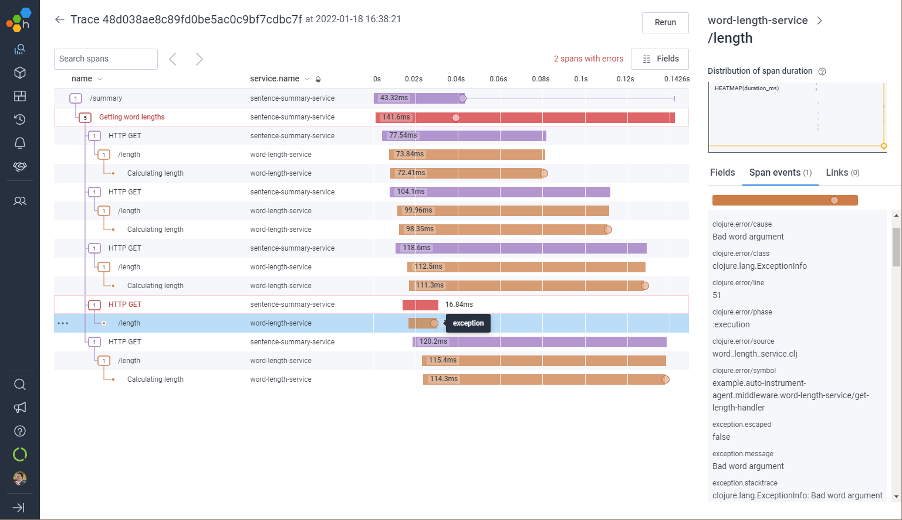
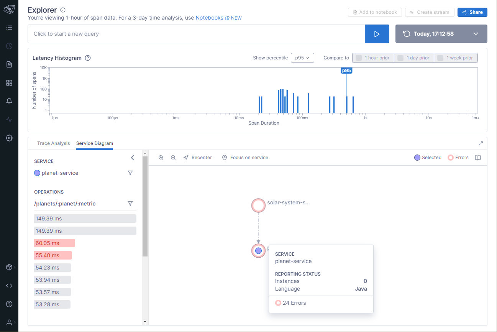

= `clj-otel`
:icons: font
ifdef::env-github[]
:tip-caption: :bulb:
:note-caption: :information_source:
:important-caption: :heavy_exclamation_mark:
:caution-caption: :fire:
:warning-caption: :warning:
endif::[]

image:https://img.shields.io/clojars/v/com.github.steffan-westcott/clj-otel-api?logo=clojure&logoColor=white[Clojars,link=https://clojars.org/com.github.steffan-westcott/clj-otel-api]
ifndef::env-cljdoc[]
image:https://cljdoc.org/badge/com.github.steffan-westcott/clj-otel-api[cljdoc,link=https://cljdoc.org/d/com.github.steffan-westcott/clj-otel-api/CURRENT]
endif::[]
image:https://img.shields.io/badge/changelog-grey[changelog,link=CHANGELOG.adoc]
image:https://img.shields.io/github/license/steffan-westcott/clj-otel[License]
image:https://img.shields.io/badge/clojurians-clj--otel-blue.svg?logo=slack[Slack channel,link=https://clojurians.slack.com/messages/clj-otel]

`clj-otel` provides a *small idiomatic Clojure API* for adding *telemetry* to your libraries and applications using https://opentelemetry.io/[*OpenTelemetry*], an emerging standard for telemetry in cloud-native software, enabling effective *observability*.

.A distributed trace displayed in https://www.honeycomb.io/[Honeycomb]

.Exploring microservice dependencies with https://www.servicenow.com/products/observability.html[ServiceNow Cloud Observability]

== Requirements

`clj-otel` is tested with Clojure 1.11.1 and is based on the reference https://github.com/open-telemetry/opentelemetry-java[OpenTelemetry for Java] implementation, which supports Java 8 and higher.

== Quickstart

`clj-otel` is highly configurable and may be used in many ways.
This quickstart briefly outlines getting started in a local environment.
Find more in-depth information on `clj-otel` in the xref:_documentation[documentation] and xref:_examples[examples].

* To add manual instrumentation to your library or application at design time
** Add project dependency
+
.`deps.edn`
[source,clojure]
----
{;; ...
 :deps {com.github.steffan-westcott/clj-otel-api {:mvn/version "0.2.4.1"}}}
----
** To add traces telemetry, use Clojure functions such as https://cljdoc.org/d/com.github.steffan-westcott/clj-otel-api/CURRENT/api/steffan-westcott.clj-otel.api.trace.span#with-span![`steffan-westcott.clj-otel.api.trace.span/with-span!`] to create spans with attributes
+
[source,clojure]
----
(defn validate-profile [profile]
  (span/with-span! {:name       "Validating profile"
                    :attributes {:system/profile-id (:id profile)}}
    (validate profile)))
----
** To add metrics telemetry, use Clojure functions in https://cljdoc.org/d/com.github.steffan-westcott/clj-otel-api/CURRENT/api/steffan-westcott.clj-otel.api.metrics.instrument[`steffan-westcott.clj-otel.api.metrics.instrument`] to create instruments, then add or record measurements with attributes
+
[source,clojure]
----
(defonce set-password-failure-count
  (instrument/instrument {:name "app.set-password-failure-count"
                          :instrument-type :counter}))

(instrument/add! set-password-failure-count {:value 1
                                             :attributes {:reason :too-short}})
----

* To export telemetry data (from both manual and automatic instrumentation) from an application at runtime
** Download the latest OpenTelemetry instrumentation JAR `opentelemetry-javaagent.jar` from the https://github.com/open-telemetry/opentelemetry-java-instrumentation/releases[OpenTelemetry instrumentation agent releases page].
** Add the following JVM options to your application, assuming export of traces telemetry only to an OTLP compliant backend such as https://www.jaegertracing.io/[Jaeger]
+
----
"-javaagent:opentelemetry-javaagent.jar"
"-Dotel.resource.attributes=service.name=NAME-OF-YOUR-SERVICE"
"-Dotel.metrics.exporter=none"
"-Dotel.logs.exporter=none"
----

* To receive exported telemetry data
** Prepare a telemetry backend such as Jaeger
+
[source,bash]
----
docker run --rm                     \
           -p 16686:16686           \
           -p 4317:4317             \
           jaegertracing/all-in-one \
           --collector.otlp.enabled=true
----

* To explore application behaviour described by the received telemetry data
** Use telemetry backend features such as the Jaeger user interface at http://localhost:16686/search

NOTE: For demonstration configurations that export traces and metrics telemetry, see the xref:_examples[examples].

[#_documentation]
== Documentation

* link:doc/tutorial.adoc[Tutorial] : A walk-through of instrumenting a small Clojure program and viewing its telemetry.
* link:doc/guides.adoc[Guides] : Common task recipes for adding telemetry to your Clojure libraries and applications, then configuring and running applications with telemetry.
* link:doc/reference.adoc[API & Reference] : API documentation for all `clj-otel` modules.
* link:doc/concepts.adoc[Concepts] : A primer on observability, OpenTelemetry and what this project `clj-otel` enables for Clojure libraries and applications.

[#_examples]
== Examples

Find complete example applications in the `examples` directory.
The examples aim to show:

* Adding automatic and manual instrumentation to applications
* Configuring and running applications that export telemetry data
* Viewing telemetry data in backends

See more xref:doc/examples.adoc[information on configuring and running the examples].

== Project status

* `clj-otel` is a young, alpha grade project with limited use in a production setting.
Breaking API changes may still be made, but there should be few, if any.
* For manual instrumentation:
** Coverage of the Traces API is complete.
*** Trace semantics conventions support for https://github.com/open-telemetry/semantic-conventions/blob/main/docs/exceptions/exceptions-spans.md[recording exceptions] is complete.
*** Trace semantics support for https://github.com/open-telemetry/semantic-conventions/blob/main/docs/http/http-spans.md[HTTP spans] in applications run without the OpenTelemetry instrumentation agent is limited.
*** Support for wrapping asynchronous Clojure code in spans is complete.
The API is minimal and low-level, supporting any async library that works with callbacks.
Perhaps with community feedback, this will be expanded to add more specialised support for popular async libraries.
Code for creating spans around `core.async` channels can be found in the examples, specifically the `<with-span-binding` macro.
** Coverage of the Metrics API is complete.
*** Metrics HTTP semantics support for applications run without the OpenTelemetry instrumentation agent is very limited.
** There is currently no coverage of the Logs API.
* For the programmatic configuration of the OpenTelemetry SDK:
** Coverage of Traces `TracerProvider` is complete.
** Coverage of Metrics `MeterProvider` is in progress.
Most configuration options are supported, but some public details of the OpenTelemetry Java SDK are not yet stable.
** There is currently no coverage of Logging `LoggerProvider`.

== TODO

* For manual instrumentation:
** Add Logs API support.
** Consider supporting more https://github.com/open-telemetry/semantic-conventions/blob/main/docs/general/trace.md[trace semantics conventions].
* Maintain parity with the latest version of https://github.com/open-telemetry/opentelemetry-java[`opentelemetry-java`].
* Implement integration tests using https://github.com/javahippie/clj-test-containers[clj-test-containers] or similar.
* Consider ClojureScript OpenTelemetry support in the browser and node.js using https://github.com/open-telemetry/opentelemetry-js[`opentelemetry-js`]; this will likely be a separate project.

== Changelog

See xref:CHANGELOG.adoc[changelog]

== Contributing & contact

The *most needed* contribution is *experience reports* of `clj-otel` use in production systems.
I am keen to hear of usages of `clj-otel` and any problems and successes.
`clj-otel` is a very young project, so now is an ideal time to provide *feedback* on the API design as improvements can be made freely.

I will be happy to consider pull requests for minor changes, but I may not accept more significant changes while I make a start on some items in the TODO list.

For questions or feedback on `clj-otel`, contact me on the https://clojurians.slack.com/messages/clj-otel[`#clj-otel`] channel in http://clojurians.net/[Clojurians Slack], user `steffan`.

== Development

=== Requirements

To develop `clj-otel`, you should first install the following tools:

* https://clojure.org/guides/deps_and_cli[Clojure CLI tools]
* https://github.com/clj-kondo/clj-kondo/blob/master/doc/install.md[`clj-kondo` executable binary]
* https://github.com/kkinnear/zprint#get-zprint[`zprint` executable binary] (1.2.7 or later)

=== Developing

* Get information on available build scripts with this command:
+
[source,bash]
----
clojure -A:deps -T:build help/doc
----
* Before making any pull requests, please ensure the source code has been linted and formatted with these commands:
+
[source,bash]
----
clojure -T:build lint
clojure -T:build fmt
----

== Acknowledgements

I want to thank:

* You (yes, you) for having the curiosity to look into this project.
Thank you.
* My friends Golnaz and Nimmo, for pointing me in the direction of observability and OpenTelemetry.
Without them, I wouldn't have had the idea to do this project.
* The OpenTelemetry community and all makers of telemetry backends for making the effective observability of systems a tangible reality.
Cloud-native software is so complex now, we need all the help we can get to understand how well it is (or is not) working.
* The https://diataxis.fr/[Diátaxis Documentation Framework], for a simple way to structure technical documentation.

== License

Copyright © 2021-2023 Steffan Westcott +
Distributed under the http://www.apache.org/licenses/LICENSE-2.0[Apache License v2.0]