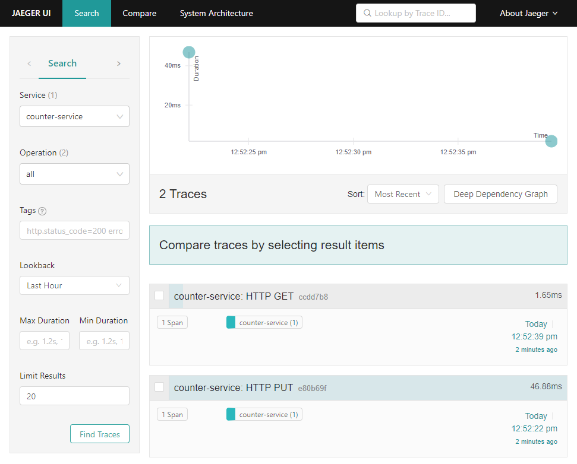
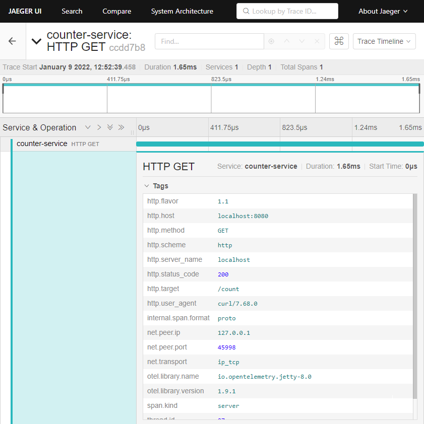
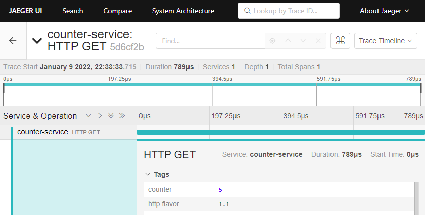
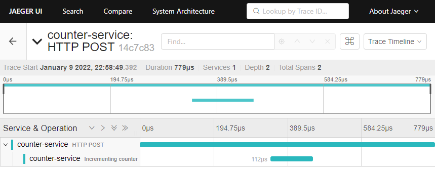

= Tutorial
:toc:
:toc-placement!:
:icons: font
ifdef::env-github[]
:tip-caption: :bulb:
:note-caption: :information_source:
:important-caption: :heavy_exclamation_mark:
:caution-caption: :fire:
:warning-caption: :warning:
endif::[]

In this tutorial, you will add trace telemetry to a Clojure HTTP server application and view the traces in https://www.jaegertracing.io/[Jaeger], a telemetry backend.

You will first add automatic instrumentation to quickly get telemetry without changing any application code.
You then add manual instrumentation to enrich the telemetry data and gain further insight on the application behaviour.

The tutorial walks through creation and instrumentation of the application from scratch.
For reference, the source code of the application before and after instrumentation can be found in the `tutorial` directory of this repository.

The tutorial assumes a Unix-like OS equipped with Docker and a Clojure development environment.
It is assumed you are comfortable working in a Clojure REPL and are familiar with Ring-based HTTP server development.

toc::[]

== The `counter-service` application

The `counter-service` application is a simple Jetty HTTP service using Ring that maintains an integer counter.

* `PUT /reset?n=3` resets the counter, here to the value 3
* `GET /count` returns the current counter value
* `POST /inc` increments the counter by 1

Initially the application has no instrumentation.

* In your favourite development environment, create a project with these two files:
+
.`./deps.edn`
[source,clojure]
----
{:paths ["src"]

 :deps  {org.clojure/clojure     {:mvn/version "1.11.0"}
         ring/ring-jetty-adapter {:mvn/version "1.9.5"}}}
----
+
.`./src/tutorial/counter_service.clj`
[source,clojure]
----
(ns tutorial.counter-service
  (:require [ring.adapter.jetty :as jetty]
            [ring.middleware.params :as params]
            [ring.util.response :as response]))

(defonce counter (atom 0))

(defn wrap-exception [handler]
  (fn [request]
    (try
      (handler request)
      (catch Throwable e
        (let [resp (response/response (ex-message e))]
          (response/status resp 500))))))

(defn reset-count-handler [{:keys [query-params]}]
  (let [n (Integer/parseInt (get query-params "n"))]
    (reset! counter n)
    (response/status 204)))

(defn get-count-handler []
  (let [n @counter]
    (response/response (str n))))

(defn inc-count-handler []
  (swap! counter inc)
  (response/status 204))

(defn handler [{:keys [request-method uri] :as request}]
  (case [request-method uri]
    [:put "/reset"] (reset-count-handler request)
    [:get "/count"] (get-count-handler)
    [:post "/inc"] (inc-count-handler)
    (response/not-found "Not found")))

(def service
  (-> handler
      params/wrap-params
      wrap-exception))

(defonce server
  (jetty/run-jetty #'service {:port 8080 :join? false}))
----

* In a REPL load the namespace `tutorial.counter-service` to start the server.

* With `counter-service` running, use `curl` to try it out:
+
[source,bash]
----
curl -X PUT "http://localhost:8080/reset?n=3"
curl -X GET "http://localhost:8080/count"
# 3
curl -X POST "http://localhost:8080/inc"
curl -X GET "http://localhost:8080/count"
# 4
----

== Start telemetry backend

You will now start a telemetry backend that will receive and display telemetry trace data exported by the application.

* Enter the following command to start a Jaeger instance in a container using Docker:
+
[source,bash]
----
docker run --rm -p 16686:16686 -p 14250:14250 jaegertracing/all-in-one
----

* Once Jaeger has started, verify you can access the user interface by navigating to http://localhost:16686/search in a web browser.
+
There is no telemetry data to view yet as the application is not instrumented.

NOTE: When finished, use `CTRL`+`C` to tear down the container.

== Add automatic instrumentation

The application uses Jetty, which is supported by the OpenTelemetry instrumentation agent.

* Download the file `opentelemetry-javaagent.jar` from the https://github.com/open-telemetry/opentelemetry-java-instrumentation/releases[OpenTelemetry instrumentation agent releases page].
Ensure the file is placed in the project root directory (the same directory as `deps.edn`)

* Add an alias `:otel`:
+
.`./deps.edn`
[source,clojure]
----
{:paths   ["src"]

 :deps    {org.clojure/clojure     {:mvn/version "1.11.0"}
           ring/ring-jetty-adapter {:mvn/version "1.9.5"}}

 :aliases {:otel {:jvm-opts ["-javaagent:opentelemetry-javaagent.jar"
                             "-Dotel.resource.attributes=service.name=counter-service"
                             "-Dotel.traces.exporter=jaeger"]}}}
----

* Restart the REPL with the alias `:otel` enabled and reload the `tutorial.counter-service` namespace to run the server with automatic instrumentation.
+
Now as each request is handled by the application, a server span is exported to Jaeger.

* Exercise the server by sending a couple of requests:
+
[source,bash]
----
curl -X PUT "http://localhost:8080/reset?n=7"
curl -X GET "http://localhost:8080/count"
# 7
----

* In a web browser navigate to the Jaeger search page at http://localhost:16686/search.
In the `Search` options, select `counter-service`  in the `Service` selector and click the `Find Traces` button.
+

+
You will see a trace corresponding to each request handled by the server.

* Click on the trace for `HTTP GET` to view it, then click on the single span in the trace to expand its details.
+

+
The span's `Tags` attributes describe this as a server span for an HTTP `GET` request for target `/count` with an HTTP response code of 200.
The span's `Process` attributes describe the instrumented application and its environment such as the service name, runtime JVM, process, OS and host.

== Add manual instrumentation

You will now enrich the telemetry detail by adding manual instrumentation on top of the automatic instrumentation.

* Add a dependency `com.github.steffan-westcott/clj-otel-api`:
+
.`./deps.edn`
[source,clojure]
----
{:paths   ["src"]

 :deps    {org.clojure/clojure                      {:mvn/version "1.11.0"}
           ring/ring-jetty-adapter                  {:mvn/version "1.9.5"}
           com.github.steffan-westcott/clj-otel-api {:mvn/version "0.1.1"}}

 :aliases {:otel {:jvm-opts ["-javaagent:opentelemetry-javaagent.jar"
                             "-Dotel.resource.attributes=service.name=counter-service"
                             "-Dotel.traces.exporter=jaeger"]}}}
----

* Restart the REPL (again with the alias `:otel` enabled) to pick up the new dependency.

* Update the Ring service definition to add server span support:
+
.`./src/tutorial/counter_service.clj`
[source,clojure]
----
(ns tutorial.counter-service
  (:require [ring.adapter.jetty :as jetty]
            [ring.middleware.params :as params]
            [ring.util.response :as response]
            [steffan-westcott.clj-otel.api.trace.http :as trace-http]
            [steffan-westcott.clj-otel.api.trace.span :as span]))

;; ...

(def service
  (-> handler
      params/wrap-params
      wrap-exception
      (trace-http/wrap-server-span)))
----

* Update the `get-count-handler` function to add an attribute `counter` to the existing server span as follows:
+
[source,clojure]
----
(defn get-count-handler []
  (let [n @counter]
    (span/add-span-data! {:attributes {:counter n}})
    (response/response (str n))))
----

* Reload the namespace in the REPL and issue some more requests:
+
[source,bash]
----
curl -X PUT "http://localhost:8080/reset?n=5"
curl -X GET "http://localhost:8080/count"
# 5
----

* In the Jaeger UI, navigate back to the search page and click the `Find Traces` button again to display the new traces.
Click the most recent `HTTP GET` trace and expand the `Tags` of the single span.
+

+
You will note that the attribute `counter` you added in the code appears in the exported span with value `5`.

* Update the `inc-count-handler` function to add a new span that wraps part of the function body:
+
[source,clojure]
----
(defn inc-count-handler []
  (span/with-span! {:name "Incrementing counter"}
    (swap! counter inc))
  (response/status 204))
----

* Reload the namespace once more and exercise the function:
+
[source,bash]
----
curl -X POST "http://localhost:8080/inc"
----

* Find the `HTTP POST` trace on the Jaeger search page (remember to refresh with the `Find Traces` button) and click to view its details.
+

+
You will observe this trace has 2 spans; a root server span named `HTTP POST` and a child internal span named `Incrementing counter` that you added to the code.

* Update the function `wrap-exception` to add detail about any caught exceptions to the server span:
+
[source,clojure]
----
(defn wrap-exception [handler]
  (fn [request]
    (try
      (handler request)
      (catch Throwable e
        (span/add-exception! e {:escaping? false})
        (let [resp (response/response (ex-message e))]
          (response/status resp 500))))))
----

* Reload the namespace, then issue a malformed request to cause an exception:
+
[source,bash]
----
curl -X PUT "http://localhost:8080/reset?bogus=1"
# Cannot parse null string
----

* Find the most recent `HTTP PUT` trace on the Jaeger search page.
You will see that the server span has a `Logs` event that was added by `span/add-exception!`.
The event attributes include a Clojure triage and stack trace of the caught exception.
+
image::images/jaeger-exception.png[Jaeger exception trace]
